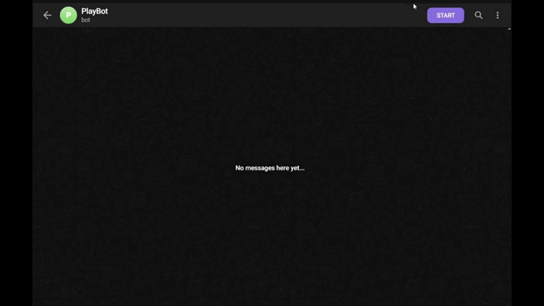

# Bot de Perguntas Telegram

## Descrição
Este é um bot Telegram desenvolvido em Python que oferece um jogo de perguntas e respostas sobre 3 temas: jogos, geografia e história. O bot permite aos usuários iniciar o jogo, responder às perguntas, solicitar dicas e receber feedback sobre suas respostas.

## Funcionalidades
- **Iniciar o jogo**: Os usuários podem começar o jogo digitando o comando `/play`. O bot selecionará aleatoriamente uma pergunta e a enviará ao usuário.
- **Responder às perguntas**: Os usuários podem enviar suas respostas às perguntas diretamente no chat. O bot verificará se a resposta está correta e fornecerá feedback adequado.
- **Obter dicas**: Os usuários podem solicitar uma dica para a pergunta atual usando o comando `/dica`. O bot fornecerá uma dica relacionada à pergunta para ajudar o usuário.
- **Instruções de uso**: Os usuários podem obter instruções sobre como usar o bot digitando o comando `/help`. O bot fornecerá informações sobre os comandos disponíveis.

## Dependências
Este projeto utiliza as seguintes dependências:
- [python-telegram-bot](https://github.com/python-telegram-bot/python-telegram-bot): Uma biblioteca Python para desenvolver bots Telegram.
- [python-dotenv](https://github.com/theskumar/python-dotenv): Uma biblioteca Python para carregar variáveis de ambiente de um arquivo `.env`.

## Bot em execução

